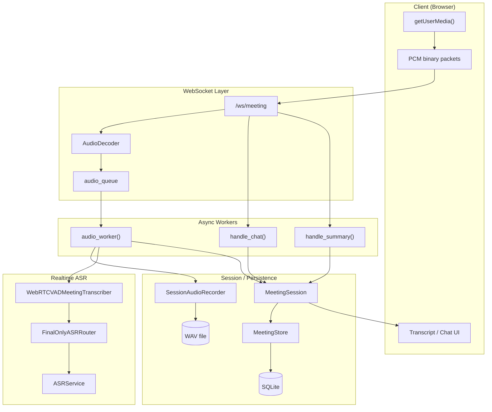
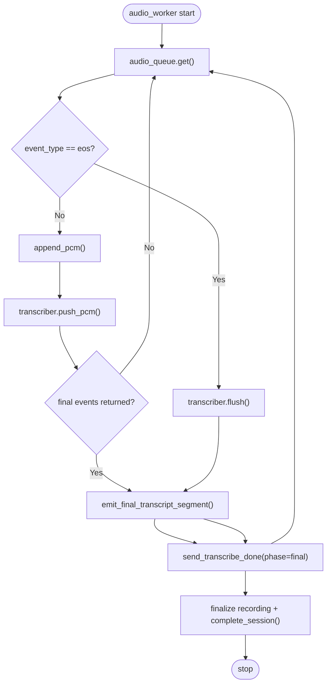
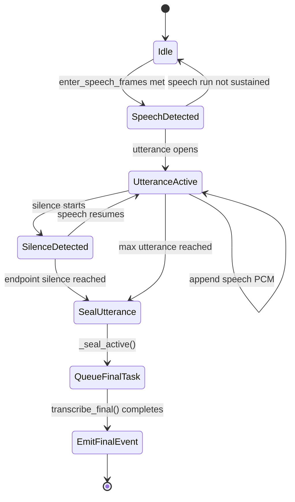
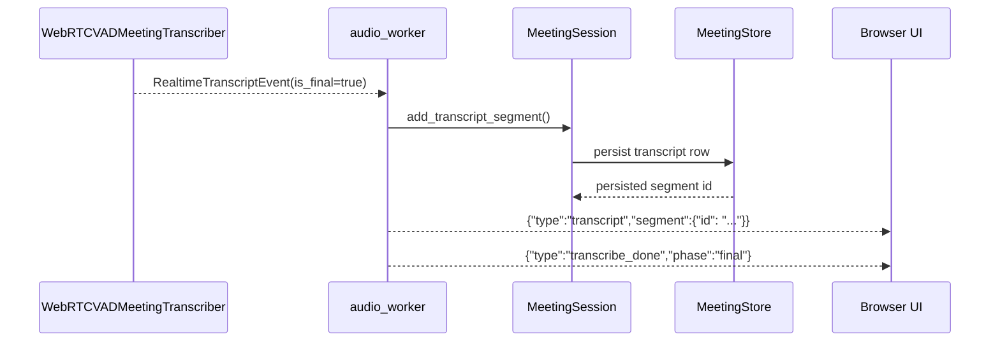
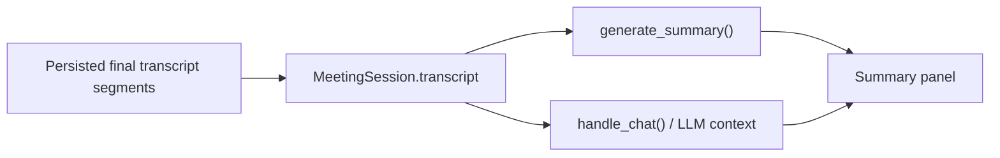

# Meeting Realtime Voice — Pipeline Mermaid Diagrams

> 本文档描述当前单轨 realtime ASR pipeline。实时链路只保留 WebRTC VAD 分段后的 final transcript，不再存在 preview/final 双轨运行。

---

## 1. 系统全景图（High-Level Architecture）

---

## 2. Audio Worker 流程（Audio Worker Flow）

---

## 3. VAD 状态机（WebRTC VAD State Machine）

---

## 4. Final Transcript 持久化链路（Persistence Flow）

---

## 5. 摘要与问答依赖（Summary / QA Grounding）

